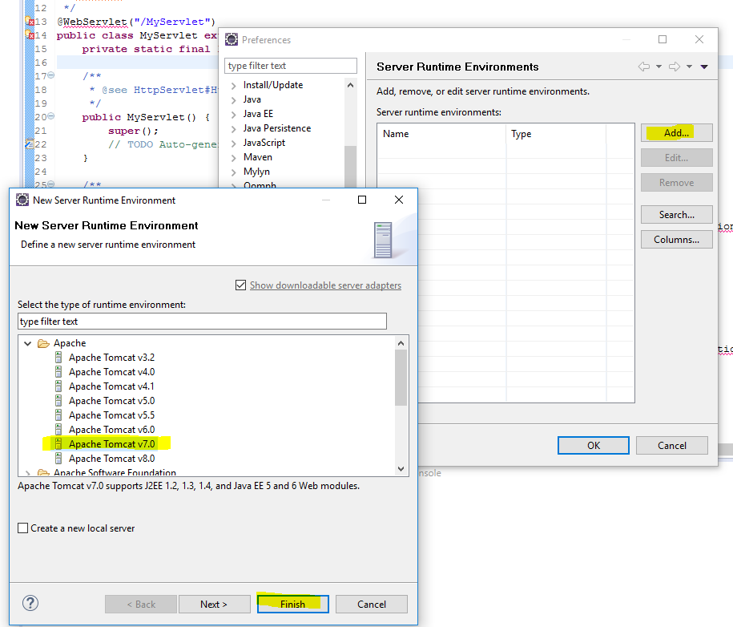

# java-servlet-test
Notes for setting up Java servlets.  

----

Note after you clone the repository you may need to set up a server runtime environment.  It is set up for Apache Tomcat v7.0 which you can do with Eclipse (Java EE IDE for Web Developers - Mars.2 Release 4.5.2) using the Window...Preferences menu (see below).

